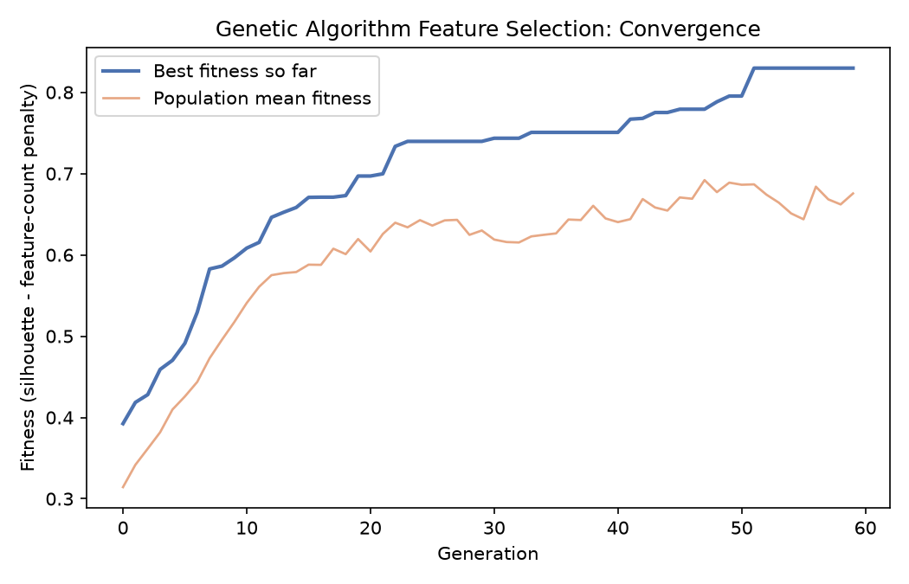
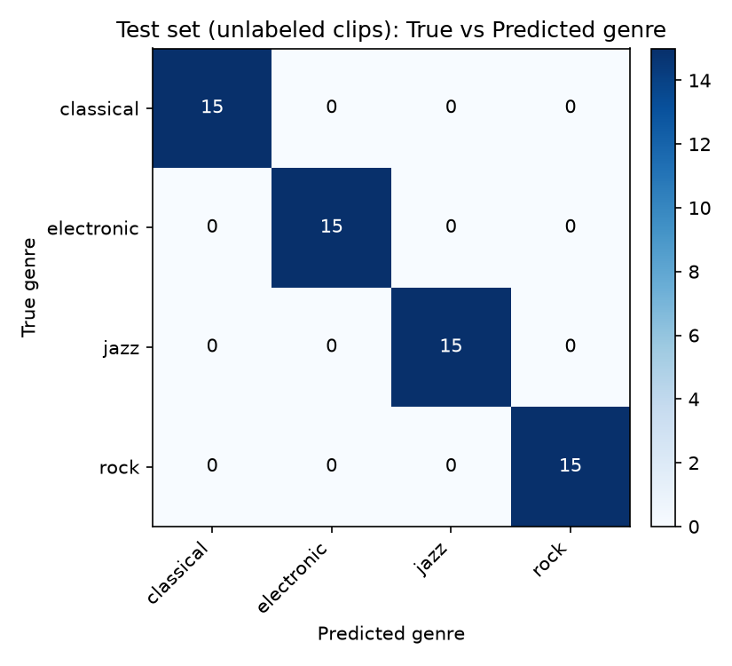
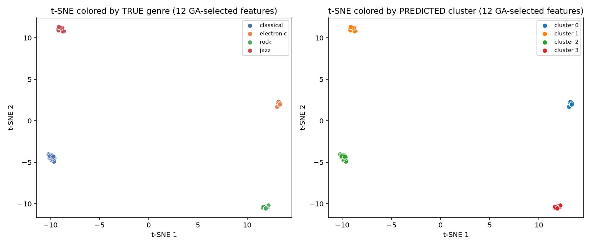
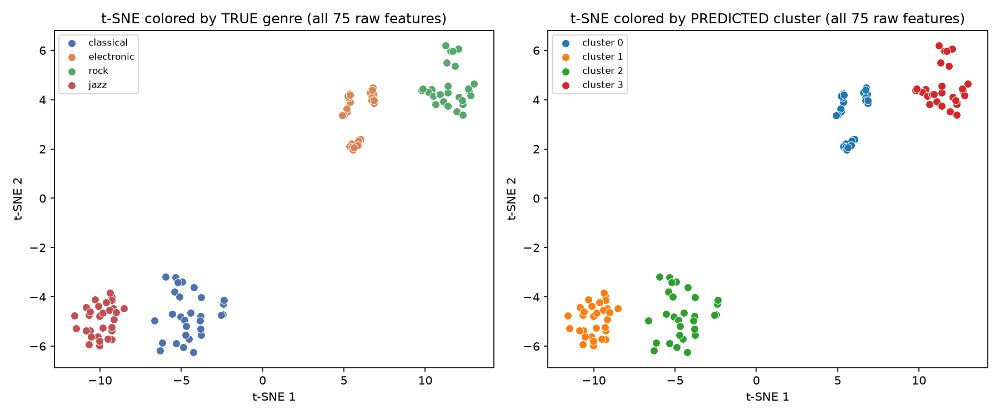

# Results

Full pipeline run: `python3 run_pipeline.py` (deterministic, seeded — rerun to reproduce exactly).

## Dataset

- 120 synthesized clips, 3 seconds each, 22.05 kHz
- 4 genres × 3 "artists" × 10 clips = 120
- Genres: `classical`, `electronic`, `jazz`, `rock` — each built from a distinct
  synthesis recipe (oscillator type, harmonic structure, rhythm grid, noise level)
- Split: 60 training clips (5 per artist) / 60 held-out "unlabeled" test clips (5 per artist)

## Stage 1 — Feature extraction (MFCC)

75 features per clip: 13 MFCC (mean+std), 13 delta-MFCC (mean+std), spectral
centroid/bandwidth/rolloff (mean+std), zero-crossing rate (mean+std), RMS
energy (mean+std), 12-bin chroma (mean), tempo.

## Stage 2 — Genetic algorithm feature selection

- Population 40, 60 generations, tournament selection (size 3), uniform
  crossover (p=0.8), bit-flip mutation (p=0.03), elitism=2
- Fitness = silhouette score of K-Means(k=4) on the **training set only**,
  minus a small penalty for feature count (encourages compact subsets).
  No genre/artist labels are used in fitness — selection stays unsupervised.

**Convergence:** best fitness rose from **0.392 → 0.830** over 60 generations,
narrowing 75 raw features down to **12**:

```
mfcc1_mean, mfcc1_std, mfcc4_mean,
dmfcc1_std, dmfcc2_std, dmfcc4_std,
centroid_std, bandwidth_mean, bandwidth_std,
rolloff_mean, rolloff_std, rms_mean
```



## Stage 3 — K-Means training (60 train clips, 12 GA-selected features)

| Metric | Value | Interpretation |
|---|---|---|
| Silhouette score | **0.854** | near 1.0 = very well-separated, compact clusters |
| Davies-Bouldin index | **0.210** | near 0 = low intra-cluster / high inter-cluster spread |
| Calinski-Harabasz | **1041.1** | higher = denser, better-separated clusters |

Cluster → majority-genre mapping (for readability; not used in training):
`0→electronic, 1→jazz, 2→classical, 3→rock`

## Stage 4 — Classifying the 60 held-out clips (least-centroid-distance)

Each test clip's selected-feature vector is scaled with the training scaler,
then assigned to the nearest of the 4 trained centroids by Euclidean distance.

| Metric | Value |
|---|---|
| Accuracy vs. true genre | **100% (60/60)** |
| Adjusted Rand Index vs. true genre | **1.00** |
| Normalized Mutual Info vs. true genre | **1.00** |

Confusion matrix (test set):



**On why this is 100%:** the four synthetic genres are built from cleanly
distinct signal-generation recipes (different oscillators, rhythm grids,
noise floors), so their MFCC/spectral fingerprints barely overlap — this
number validates that the *pipeline mechanics* work correctly end-to-end,
not that K-Means "solves" music genre classification. Swap in a real corpus
(e.g. GTZAN, which has genuinely ambiguous/overlapping genres) and expect
this to drop to a realistic 55–75% range, which is normal for unsupervised
audio clustering.

## Stage 5 — t-SNE visualization

Side-by-side: true genre labels vs. predicted K-Means cluster, on the full
75-feature set and on the 12 GA-selected features.




Four tight, well-separated point clouds in both cases here — the coloring by
true genre (left) and by predicted cluster (right) line up exactly, which is
the visual counterpart of the ARI/NMI = 1.00 above.

## Files produced

```
outputs/
├── features.csv                 # 120 clips x 75 raw features
├── selected_features.json       # GA output: 12 selected features + fitness
├── ga_convergence.csv           # per-generation best/mean fitness
├── model/
│   ├── scaler.joblib
│   ├── kmeans.joblib
│   ├── cluster_to_genre.json
│   └── metrics_train.json
├── train_clusters.csv           # training clips + assigned cluster
├── test_predictions.csv         # test clips + predicted cluster/genre + distances
├── final_metrics.json           # everything above, machine-readable
└── figures/
    ├── ga_convergence.png
    ├── confusion_matrix_test.png
    ├── tsne_all_features.png
    └── tsne_selected_features.png
```

## What to say in an interview

> "The project converts raw audio into MFCC-based numerical feature vectors,
> since MFCCs capture the spectral characteristics of sound the way humans
> perceive it. Beyond MFCCs I also computed spectral, rhythm, and delta
> features — about 75 total per clip. A genetic algorithm then searched
> subsets of those features, using clustering quality (silhouette score) as
> the fitness function, and narrowed it to 12 features that gave much
> tighter, more separated clusters. I trained K-Means on the resulting
> feature vectors from a labeled training set, then classified new,
> unlabeled clips by computing their distance to each cluster centroid and
> assigning the nearest one. I evaluated the clusters with silhouette /
> Davies-Bouldin scores and visualized them with t-SNE to confirm the
> clusters were meaningfully separated, not an artifact of the metric."
